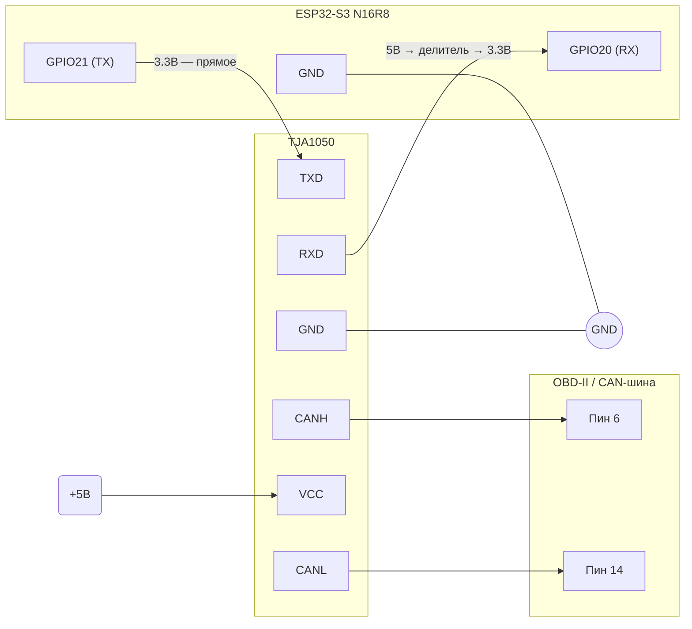
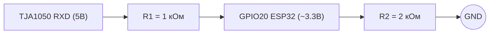

# ESP32S3 CAN2WiFi

CAN-шина → WiFi мост на базе ESP32-S3. Читает фреймы CAN через встроенный периферийный модуль TWAI и транслирует их по WiFi (Telnet, порт 23) и UART (115200 бод) в формате протокола GVRET. Совместим с программой **SavvyCAN**.

---

## Железо

### Контроллер
**ESP32-S3 N16R8** — 16 МБ Flash, 8 МБ PSRAM (Octal).

### Трансивер CAN
**TJA1050** (или аналог MCP2551) — преобразует уровни CAN-шины (дифференциальный сигнал CANH/CANL) в логику для ESP32.

### Подключение



**Делитель напряжения на линии RX** (TJA1050 выдаёт 5В, GPIO ESP32 выдерживает 3.3В):



---

## Необходимый софт

### 1. Git

Скачай и установи: https://git-scm.com/downloads

### 2. Python 3.8 – 3.12

Скачай и установи: https://www.python.org/downloads/

> ⚠️ При установке на Windows обязательно поставь галочку **"Add Python to PATH"**.

Проверь в терминале:
```bash
python --version
```

### 3. ESP-IDF 5.3.1

Официальный фреймворк Espressif для разработки под ESP32.

#### Вариант А — через установщик (рекомендуется для Windows)

1. Скачай установщик: https://dl.espressif.com/dl/esp-idf/
   Выбери **ESP-IDF v5.3.1 Online** или **Offline**.
2. Запусти установщик, выбери путь (например `C:\esp\esp-idf`).
3. Установщик сам поставит: тулчейн, CMake, Ninja, OpenOCD.
4. После установки появится ярлык **ESP-IDF 5.3.1 CMD** или **PowerShell** — используй его для всех команд.

#### Вариант Б — вручную через git

```bash
git clone --recursive https://github.com/espressif/esp-idf.git -b v5.3.1 C:\esp\esp-idf
cd C:\esp\esp-idf
install.bat esp32s3
```

После установки каждый раз перед работой активируй окружение:
```bash
# Windows CMD
C:\esp\esp-idf\export.bat

# Windows PowerShell
C:\esp\esp-idf\export.ps1

# Linux / macOS
. $HOME/esp/esp-idf/export.sh
```

---

## Сборка проекта

### 1. Скачай исходники

```bash
git clone https://github.com/твой-аккаунт/can2wifi_esp32s3.git
cd can2wifi_esp32s3
```

### 2. Подключи плату к компьютеру

Используй USB-кабель с поддержкой передачи данных (не только зарядка).
На ESP32-S3 обычно два порта USB — используй тот, что подписан **UART** или **USB-SERIAL**.

### 3. Первая сборка

Открой **ESP-IDF 5.3.1 CMD** (или активируй окружение вручную) и выполни:

```bash
idf.py build
```

После успешной сборки готовые файлы прошивки автоматически скопируются в папку `firmware/`:
```
firmware/
├── ESP32S3_CAN2WIFI.bin     ← основная прошивка
├── bootloader.bin            ← загрузчик
└── partition-table.bin       ← таблица разделов
```

---

## Прошивка

### Определи COM-порт

**Windows:** Диспетчер устройств → Порты (COM и LPT) → найди `USB Serial Device (COMx)`.

**Linux/macOS:**
```bash
ls /dev/ttyUSB*   # Linux
ls /dev/tty.usb*  # macOS
```

### Прошивка одной командой

```bash
idf.py flash
```

ESP-IDF определит порт автоматически. Если не определил — укажи явно:

```bash
# Windows
idf.py -p COM3 flash

# Linux
idf.py -p /dev/ttyUSB0 flash
```

### Сборка + прошивка + монитор за один раз

```bash
idf.py build flash monitor
```

Монитор выводит отладочные сообщения в реальном времени (115200 бод).
Выход из монитора: **Ctrl + ]**

---

## Использование

### Настройки по умолчанию

| Параметр | Значение |
|----------|----------|
| WiFi SSID | `AVTOTOR_CAN` |
| WiFi пароль | `mypassword` |
| IP адрес | `192.168.4.1` |
| Telnet порт | `23` |
| CAN скорость | `500 кбит/с` |
| UART | `115200 бод` |

### Подключение SavvyCAN

1. Скачай SavvyCAN: https://www.savvycan.com/
2. Подключи компьютер к WiFi точке доступа `AVTOTOR_CAN`, пароль `mypassword`.
3. В SavvyCAN: **Connection → Add New Device Connection**
4. Выбери **Network Connection**, адрес `192.168.4.1`, порт `23`.
5. Нажми **Create New Connection** → данные с CAN-шины начнут поступать.

### Последовательная консоль

При подключении через USB-UART доступна текстовая консоль (115200 бод):

| Команда | Действие |
|---------|----------|
| `h` | показать меню |
| `R` | сброс к заводским настройкам |

---

## Изменение параметров

Все настройки по умолчанию — в [main/config_idf.h](main/config_idf.h):

```c
#define TWAI_TX_PIN   21        // GPIO для CAN TX
#define TWAI_RX_PIN   20        // GPIO для CAN RX
#define SSID_NAME     "AVTOTOR_CAN"
#define WPA2KEY       "mypassword"
#define ESP32_BUILTIN_LED  2    // GPIO светодиода
```

После изменения пересобери и перепрошей:
```bash
idf.py build flash
```

---

## Структура проекта

```
.
├── main/
│   ├── main.c                  # Точка входа, главный цикл
│   ├── config_idf.h            # Все константы и настройки
│   ├── esp32_can_idf.c/h       # Драйвер TWAI (CAN)
│   ├── can_manager.c/h         # Чтение и маршрутизация CAN фреймов
│   ├── gvret_comm.c/h          # Протокол GVRET (совместимость с SavvyCAN)
│   ├── wifi_manager_idf.c/h    # WiFi AP, Telnet сервер, UDP broadcast
│   ├── uart_serial.c/h         # UART0 ввод/вывод
│   ├── logger_idf.c/h          # Логирование (DEBUG/INFO/WARN/ERROR)
│   ├── sys_io_idf.c/h          # Управление светодиодом
│   ├── serial_console_idf.c/h  # Текстовая консоль
│   └── CMakeLists.txt
├── firmware/                   # Готовые .bin файлы (генерируются при сборке)
├── sdkconfig.defaults          # Конфигурация ESP-IDF для N16R8
├── CMakeLists.txt
└── README.md
```

---

## Решение проблем

**Плата не определяется в системе**
- Попробуй другой USB-кабель (обязательно data-кабель).
- Установи драйвер CH340/CP2102: https://www.wch.cn/downloads/CH341SER_EXE.html

**Ошибка `idf.py: command not found`**
- Не активировано окружение ESP-IDF. Запусти `export.bat` (Windows) или `export.sh` (Linux/macOS).

**Плата не входит в режим прошивки**
- Зажми кнопку **BOOT** на плате, нажми **RESET**, затем отпусти **BOOT**.
- Повтори `idf.py flash`.

**Ошибка компиляции после изменения sdkconfig.defaults**
- Выполни полную очистку: `idf.py fullclean`, затем `idf.py build`.

**SavvyCAN не получает данные**
- Убедись что плата подключена к CAN-шине (CANH/CANL).
- Проверь скорость CAN (по умолчанию 500 кбит/с) — должна совпадать с шиной.
- Открой монитор `idf.py monitor` и убедись что фреймы принимаются.
