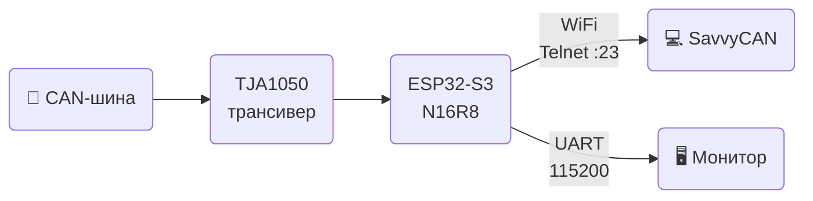

# 🚗 ESP32S3 CAN2WiFi

> Мост **CAN-шина → WiFi** на базе ESP32-S3.
> 
> Читает фреймы CAN через TWAI и транслирует по WiFi (Telnet :23) и UART в формате GVRET.
> 
> Совместим с **SavvyCAN**.

---

## ⚡ Как это работает



---

## 🔧 Железо

| Компонент | Описание |
|-----------|----------|
| **ESP32-S3 N16R8** | 16 МБ Flash, 8 МБ PSRAM Octal |
| **TJA1050** | CAN трансивер (или MCP2551) |
| **Резисторы** | 1 кОм + 2 кОм (делитель напряжения на RX) |

### 🔌 Подключение ESP32-S3 ↔ TJA1050

| ESP32-S3 N16R8 | | TJA1050 | | CAN-шина (OBD-II) |
|:--------------:|:-:|:-------:|:-:|:-----------------:|
| GPIO21 TX | → | TXD | | |
| GPIO20 RX | ← | RXD | | |
| | | CANH | → | Пин 6 |
| | | CANL | → | Пин 14 |
| GND | — | GND | | |

> ⚠️ Линия **RXD → GPIO20 RX**: TJA1050 выдаёт 5В — обязательно через делитель **1 кОм + 2 кОм → GND**.

---

## 🛠️ Необходимый софт

- 🐙 **Git** — https://git-scm.com/downloads
- 🐍 **Python 3.8–3.12** — https://www.python.org/downloads/ *(при установке: Add to PATH)*
- 📦 **ESP-IDF 5.3.1** — https://dl.espressif.com/dl/esp-idf/

### Установка ESP-IDF (Windows)

1. Скачай установщик **ESP-IDF v5.3.1**
2. Установи в `C:\esp\esp-idf` — тулчейн, CMake, Ninja поставятся автоматически
3. Используй ярлык **ESP-IDF 5.3.1 CMD** для всех команд ниже

<details>
<summary>Linux / macOS</summary>

```bash
git clone --recursive https://github.com/espressif/esp-idf.git -b v5.3.1 ~/esp/esp-idf
cd ~/esp/esp-idf && ./install.sh esp32s3
. ~/esp/esp-idf/export.sh
```
</details>

---

## 🚀 Сборка и прошивка

```bash
# 1. Клонируй репозиторий
git clone https://github.com/avtotor/can2wifi_esp32s3.git
cd can2wifi_esp32s3

# 2. Сборка
idf.py build

# 3. Прошивка (порт определится автоматически)
idf.py flash

# Или всё сразу
idf.py build flash monitor
```

После сборки файлы прошивки автоматически копируются в `firmware/`:
```
firmware/
├── ESP32S3_CAN2WIFI.bin   ← основная прошивка
├── bootloader.bin          ← загрузчик
└── partition-table.bin     ← таблица разделов
```

> 💡 Если порт не определился: `idf.py -p COM3 flash` (Windows) или `idf.py -p /dev/ttyUSB0 flash` (Linux)

---

## 📡 Использование

### Настройки по умолчанию

| Параметр | Значение |
|----------|----------|
| 📶 WiFi SSID | `AVTOTOR_CAN` |
| 🔑 Пароль | `mypassword` |
| 🌐 IP адрес | `192.168.4.1` |
| 🔌 Telnet порт | `23` |
| 🚗 CAN скорость | `500 кбит/с` |
| 🖥️ UART | `115200 бод` |

### Подключение SavvyCAN


---

## ⚙️ Изменение параметров

Все настройки в [main/config_idf.h](main/config_idf.h):

```c
#define TWAI_TX_PIN   21        // GPIO CAN TX
#define TWAI_RX_PIN   20        // GPIO CAN RX
#define SSID_NAME     "AVTOTOR_CAN"
#define WPA2KEY       "mypassword"
```

После изменений: `idf.py build flash`

---

## 📁 Структура проекта

```
├── main/
│   ├── main.c                  # Точка входа
│   ├── config_idf.h            # Все настройки
│   ├── esp32_can_idf.c/h       # Драйвер TWAI
│   ├── can_manager.c/h         # Маршрутизация CAN фреймов
│   ├── gvret_comm.c/h          # Протокол GVRET
│   ├── wifi_manager_idf.c/h    # WiFi AP + Telnet
│   ├── uart_serial.c/h         # UART
│   ├── logger_idf.c/h          # Логирование
│   └── sys_io_idf.c/h          # GPIO / LED
├── firmware/                   # Готовые .bin (после сборки)
├── sdkconfig.defaults          # Конфиг ESP-IDF для N16R8
└── .github/workflows/build.yml # CI сборка
```

---

## 🆘 Решение проблем

| Проблема | Решение |
|----------|---------|
| Плата не определяется | Замени кабель на data-кабель; установи драйвер [CH340](https://www.wch.cn/downloads/CH341SER_EXE.html) |
| `idf.py: command not found` | Запусти `export.bat` / `export.sh` для активации ESP-IDF |
| Плата не входит в прошивку | Зажми **BOOT** → нажми **RESET** → отпусти **BOOT** |
| Ошибка после правки sdkconfig | Выполни `idf.py fullclean` перед сборкой |
| SavvyCAN не видит данные | Проверь скорость CAN (500 кбит/с) и подключение CANH/CANL |
