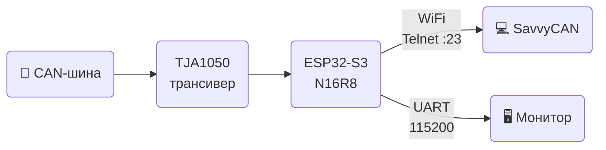

# 🚗 ESP32S3 CAN2WiFi

> Мост **CAN-шина → WiFi** на базе ESP32-S3.
> 
> Читает фреймы CAN через TWAI и транслирует по WiFi (Telnet :23) и UART в формате GVRET.
> 
> Совместим с **SavvyCAN**.

---

## ⚡ Как это работает



---

## 🔧 Железо

| Компонент | Описание |
|-----------|----------|
| **ESP32-S3 N16R8** | 16 МБ Flash, 8 МБ PSRAM Octal |
| **TJA1050** | CAN трансивер (или MCP2551) |
| **Резисторы** | 1 кОм + 2 кОм (делитель напряжения на RX) |

### 🔌 Подключение ESP32-S3 ↔ TJA1050

| ESP32-S3 N16R8 | | TJA1050 | | CAN-шина (OBD-II) |
|:--------------:|:-:|:-------:|:-:|:-----------------:|
| GPIO21 TX | → | TXD | | |
| GPIO20 RX | ← | RXD | | |
| | | CANH | → | Пин 6 |
| | | CANL | → | Пин 14 |
| GND | — | GND | | |

> ⚠️ Линия **RXD → GPIO20 RX**: TJA1050 выдаёт 5В — обязательно через делитель **1 кОм + 2 кОм → GND**.

---

## 📚 Документация

- 📄 [ESP32-S3 Technical Reference Manual](https://documentation.espressif.com/esp32-s3_technical_reference_manual_en.pdf)

---

## 🛠️ Необходимый софт

- 🐙 **Git** — https://git-scm.com/downloads
- 🐍 **Python 3.8–3.12** — https://www.python.org/downloads/ *(при установке: Add to PATH)*
- 📦 **ESP-IDF 5.3.1** — https://dl.espressif.com/dl/esp-idf/

### Установка ESP-IDF (Windows)

1. Скачай установщик **ESP-IDF v5.3.1**
2. Установи в `C:\esp\esp-idf` — тулчейн, CMake, Ninja поставятся автоматически
3. Используй ярлык **ESP-IDF 5.3.1 CMD** для всех команд ниже

<details>
<summary>Linux / macOS</summary>

```bash
git clone --recursive https://github.com/espressif/esp-idf.git -b v5.3.1 ~/esp/esp-idf
cd ~/esp/esp-idf && ./install.sh esp32s3
. ~/esp/esp-idf/export.sh
```
</details>

---

## 🚀 Сборка и прошивка

```bash
# 1. Клонируй репозиторий
git clone https://github.com/avtotor/can2wifi_esp32s3.git
cd can2wifi_esp32s3

# 2. Сборка
idf.py build

# 3. Прошивка (порт определится автоматически)
idf.py flash

# Или всё сразу
idf.py build flash monitor
```

После сборки файлы прошивки автоматически копируются в `firmware/`:
```
firmware/
├── ESP32S3_CAN2WIFI.bin   ← основная прошивка
├── bootloader.bin          ← загрузчик
└── partition-table.bin     ← таблица разделов
```

> 💡 Если порт не определился: `idf.py -p COM3 flash` (Windows) или `idf.py -p /dev/ttyUSB0 flash` (Linux)

---

## 📡 Использование

### Настройки по умолчанию

| Параметр | Значение |
|----------|----------|
| 📶 WiFi SSID | `AVTOTOR_CAN` |
| 🔑 Пароль | `mypassword` |
| 🌐 IP адрес | `192.168.4.1` |
| 🔌 Telnet порт | `23` |
| 🚗 CAN скорость | `500 кбит/с` |
| 🖥️ UART | `115200 бод` |

### Подключение SavvyCAN


---

## ⚙️ Изменение параметров

Все настройки в [main/config_idf.h](main/config_idf.h):

```c
#define TWAI_TX_PIN   21        // GPIO CAN TX
#define TWAI_RX_PIN   20        // GPIO CAN RX
#define SSID_NAME     "AVTOTOR_CAN"
#define WPA2KEY       "mypassword"
```

После изменений: `idf.py build flash`

### 🐛 CAN Debug

В [main/CMakeLists.txt](main/CMakeLists.txt) есть флаг для вывода диагностики CAN (состояние шины каждые 5 сек в `idf.py monitor`):

```cmake
# Включить:
target_compile_definitions(${COMPONENT_LIB} PRIVATE CAN_DEBUG=1)

# Выключить (закомментировать):
# target_compile_definitions(${COMPONENT_LIB} PRIVATE CAN_DEBUG=1)
```

После изменения: `idf.py build flash`

---

## 💾 Использование памяти

> Результат сборки для ESP32-S3 N16R8 (Flash 16 МБ, PSRAM 8 МБ)

| Тип памяти / Секция | Занято [байт] | Занято [%] | Свободно [байт] | Всего [байт] |
|---------------------|:-------------:|:----------:|:---------------:|:------------:|
| **Flash Code** | 566154 | 6.75% | 7822422 | 8388576 |
| .text | 566154 | 6.75% | | |
| **Flash Data** | 140544 | 0.42% | 33413856 | 33554400 |
| .rodata | 140288 | 0.42% | | |
| .appdesc | 256 | 0.0% | | |
| **DIRAM** | 122264 | 35.77% | 219496 | 341760 |
| .text | 81015 | 23.71% | | |
| .data | 21096 | 6.17% | | |
| .bss | 20016 | 5.86% | | |
| **IRAM** | 16383 | 99.99% | 1 | 16384 |
| .text | 15356 | 93.73% | | |
| .vectors | 1027 | 6.27% | | |
| **RTC FAST** | 280 | 3.42% | 7912 | 8192 |
| .rtc_reserved | 24 | 0.29% | | |

**Размер образа: 825192 байт**

<details>
<summary>Описание типов памяти</summary>

#### Flash Code (8 МБ)
Внешняя SPI Flash — хранит **исполняемый код** прошивки. CPU читает её через кэш, не напрямую. Секция `.text` — скомпилированные функции всей программы: ESP-IDF, WiFi стек, TWAI драйвер, код приложения.

#### Flash Data (32 МБ)
Та же внешняя Flash, но для **данных только для чтения**:
- `.rodata` — строковые константы, таблицы, `const`-переменные (например, строки логов, имена параметров)
- `.appdesc` — метаданные прошивки: версия, дата сборки, имя проекта

#### DIRAM (332 КБ)
Внутренняя SRAM, доступная одновременно как IRAM и DRAM (Dual-access). Основная рабочая память программы:
- `.text` — код, перемещённый в RAM для быстрого исполнения (без кэша Flash)
- `.data` — глобальные и статические переменные с ненулевым начальным значением (`static uint32_t x = 5`)
- `.bss` — глобальные и статические переменные, инициализированные нулём (`static uint32_t x = 0`); место в Flash не занимают

#### IRAM (16 КБ)
Быстрая внутренняя SRAM **только для инструкций** — CPU исполняет код отсюда без кэша и задержек. Критично для обработчиков прерываний:
- `.text` — функции с атрибутом `IRAM_ATTR` (обработчики TWAI, WiFi ISR)
- `.vectors` — таблица векторов прерываний

#### RTC FAST (8 КБ)
Память, питаемая от RTC-домена — **сохраняется во время Deep Sleep**. Используется для хранения данных, которые должны пережить сон процессора:
- `.rtc_reserved` — служебные данные ESP-IDF для управления сном и просыпанием

</details>

> ⚠️ IRAM заполнен на 99.99% (остался 1 байт) — это норма для связки WiFi + TWAI. Если добавишь свой код с `IRAM_ATTR`, линковщик выдаст ошибку `region 'iram0_0_seg' overflowed`. В этом случае освободи IRAM через `idf.py menuconfig` или добавив в [sdkconfig.defaults](sdkconfig.defaults):
>
> ```
> CONFIG_FREERTOS_PLACE_FUNCTIONS_INTO_FLASH=y   # FreeRTOS в Flash
> CONFIG_SPI_FLASH_ROM_IMPL=y                    # SPI Flash в ROM
> CONFIG_RINGBUF_PLACE_FUNCTIONS_INTO_FLASH=y    # Ring buffer в Flash
> ```

---

## 📁 Структура проекта

```
├── main/
│   ├── main.c                  # Точка входа
│   ├── config_idf.h            # Все настройки
│   ├── esp32_can_idf.c/h       # Драйвер TWAI
│   ├── can_manager.c/h         # Маршрутизация CAN фреймов
│   ├── gvret_comm.c/h          # Протокол GVRET
│   ├── wifi_manager_idf.c/h    # WiFi AP + Telnet
│   ├── uart_serial.c/h         # UART
│   ├── logger_idf.c/h          # Логирование
│   └── sys_io_idf.c/h          # GPIO / LED
├── firmware/                   # Готовые .bin (после сборки)
├── sdkconfig.defaults          # Конфиг ESP-IDF для N16R8
└── .github/workflows/build.yml # CI сборка
```

---

## 🆘 Решение проблем

| Проблема | Решение |
|----------|---------|
| Плата не определяется | Замени кабель на data-кабель; установи драйвер [CH340](https://www.wch.cn/downloads/CH341SER_EXE.html) |
| `idf.py: command not found` | Запусти `export.bat` / `export.sh` для активации ESP-IDF |
| Плата не входит в прошивку | Зажми **BOOT** → нажми **RESET** → отпусти **BOOT** |
| Ошибка после правки sdkconfig | Выполни `idf.py fullclean` перед сборкой |
| SavvyCAN не видит данные | Проверь скорость CAN (500 кбит/с) и подключение CANH/CANL |
