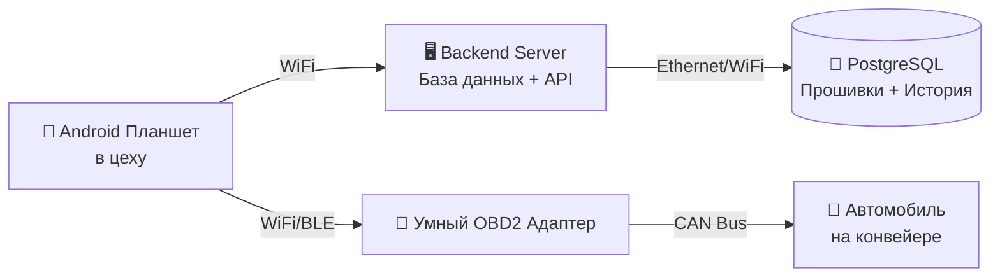

# Автоматизированный программно-аппаратный комплекс диагностики и прошивки автомобилей

## SmartAssembly Flash & Diagnostic System

Данный программно-аппаратный комплекс (ПАК) представляет собой комплексное решение для полной автоматизации процессов финальной прошивки и послесборочной диагностики автомобилей на конвейере.

Система позволяет в реальном времени идентифицировать каждый автомобиль по лоту или VIN, автоматически определять требуемый набор прошивок для всех электронных блоков управления (ECU), выполнять удалённую безопасную прошивку через OBD2-интерфейс и проводить комплексную диагностику всех критически важных систем. Все операции протоколируются на центральном сервере, что обеспечивает полную прослеживаемость, защиту от ошибок прошивки 'не той' версии и значительное сокращение времени на посту финальной сборки.

Внедрение комплекса позволяет повысить производительность конвейера, минимизировать человеческий фактор, снизить количество рекламаций по электронным системам и обеспечить соответствие самым строгим требованиям современных автомобильных производств.

---

## 🏗️ Архитектура решения

Система построена по модульному принципу и состоит из четырёх ключевых взаимосвязанных компонентов, работающих в едином информационном пространстве:



---

### 1. 🖥️ Серверное ПО (Центральное ядро системы)

Сервер является мозгом всего комплекса. Он хранит и управляет всей критически важной информацией: базой прошивок, привязкой лотов к конкретным моделям автомобилей, конфигурациями тестов и полной историей операций по каждому произведённому автомобилю.

**Основные возможности:**

- Надёжная база данных (PostgreSQL или MSSQL) с полной историей прошивок и диагностики
- Высокопроизводительный REST API для взаимодействия с планшетами и внешними системами
- Централизованное хранилище бинарных файлов прошивок (.bin, .hex, .srec) с версионированием
- Интеллектуальная логика сопоставления: 'Лот (Job ID) → Модель автомобиля → Список ECU → Требуемые версии прошивок'
- Система контроля доступа и аудита всех действий

Сервер обеспечивает защиту от прошивки неверной версии ПО и автоматически предотвращает повторную прошивку уже обработанных блоков.

---

### 2. 📱 Android-приложение «Мастер-терминал»

Мобильное приложение, установленное на промышленные планшеты, служит основным рабочим интерфейсом для мастеров на конвейере. Интерфейс разработан с учётом специфики цеховой эксплуатации: крупные элементы управления, минимальное количество кликов и максимальная наглядность.

**Ключевые функции:**

- Быстрое сканирование VIN или номера лота с помощью встроенной камеры или подключённого сканера
- Автоматический запрос с сервера актуальной конфигурации автомобиля (какие ECU нужно прошить и какими версиями)
- Управление процессом прошивки и диагностики
- Realtime-визуализация хода выполнения операций (прогресс-бары, статусы, подробные логи)
- Отображение текущего статуса всех автомобилей на посту
- Возможность ручного вмешательства при возникновении нештатных ситуаций

---

### 3. 🔌 Умный OBD2-адаптер (Hardware Gateway)

Это ключевой аппаратный компонент системы — специализированный беспроводной адаптер, разработанный специально для промышленного применения.

**Техническая основа:**

- **Основной контроллер:** ESP32-S3 (высокая производительность + встроенный WiFi + BLE)
- **CAN-интерфейс:** MCP2515 + TJA1050 или STM32 с нативным CAN (по выбору)
- **Питание:** от бортовой сети автомобиля (12V → 5V с гальванической развязкой)

**Режимы работы:**

- **Прозрачный мост** — планшет отправляет UDS-команды, адаптер передаёт их в CAN-сеть автомобиля
- **Автономный (скриптовый) режим** — прошивка и тест-скрипты предварительно загружаются в память адаптера, после чего прошивка может выполняться полностью автономно, даже при временной потере связи с планшетом

Адаптер поддерживает все необходимые диагностические протоколы: ISO-TP, UDS (Unified Diagnostic Services), включая сервисы 0x34 (Request Download), 0x36 (Transfer Data), 0x37 (Request Transfer Exit) и др.

---

### 4. 🚙 Интеграция с линией конвейера

Система органично встраивается в существующий производственный процесс:

- Автоматическая идентификация автомобиля при въезде в зону прошивки через RFID или промышленные сканеры
- Синхронизация с MES-системой завода (в перспективе)
- Чёткая маршрутизация каждого лота по технологическим позициям

---

## 🔄 Сценарий работы (Как это работает на практике)

### 1. Начало смены

Мастер берёт планшет, подключается к цеховой WiFi-сети и авторизуется. Система автоматически загружает актуальный список активных лотов.

### 2. Идентификация автомобиля

Как только автомобиль заезжает на пост, мастер сканирует QR-код или DataMatrix лота (или VIN). Приложение мгновенно запрашивает с сервера полную информацию о требуемых прошивках и тестах для данного автомобиля.

### 3. Процесс программирования ECU

- Планшет загружает необходимую прошивку с сервера
- По WiFi передаёт её на умный OBD2-адаптер (chunk-by-chunk для больших файлов)
- Адаптер через CAN-шину выполняет полную процедуру перепрограммирования блока по стандарту UDS
- На экране планшета в реальном времени отображается детальный прогресс: стирание → запись → верификация

### 4. Комплексная диагностика

После успешной прошивки автоматически запускается набор диагностических тестов:

- Чтение и анализ всех DTC (Diagnostic Trouble Codes)
- Проверка актуальных данных датчиков ключевых систем (двигатель, ABS, подушки безопасности, электроника кузова и т.д.)
- Контроль инициализации всех CAN-узлов
- Дополнительные функциональные тесты по требованию

### 5. Завершение и сохранение результатов

По окончании операций мастер нажимает 'Закрыть лот'. Планшет формирует подробный JSON-отчёт и отправляет его на сервер. Вся история сохраняется в базе данных, что позволяет в любой момент отследить, кто, когда и какую версию прошивки устанавливал на конкретный автомобиль.

---

## 🛠️ Технические особенности

### Протоколы связи:

- **Планшет ↔ Сервер:** HTTPS + REST API + JWT-авторизация
- **Планшет ↔ OBD2-адаптер:** WebSocket (низкая задержка, бинарные данные) или MQTT
- **Адаптер ↔ Автомобиль:** High-Speed CAN (ISO 15765-4)

### Безопасность:

- Защита от прошивки 'чужой' версии
- Контроль целостности прошивки (CRC/checksum)
- Полная аудит-логика всех действий
- Возможность работы в offline-режиме с последующей синхронизацией

### Хранение данных:

Прошивки и конфигурации хранятся централизованно. Для каждого лота в базе автоматически формируется актуальная 'карта прошивок'.

---

## 👥 Роли и права доступа

| Роль | Основной интерфейс | Основные права доступа |
|------|-------------------|------------------------|
| **Мастер цеха** | Android планшет | Сканирование, прошивка, диагностика, закрытие лотов |
| **Инженер по прошивкам** | Web-интерфейс сервера | Загрузка прошивок, управление конфигурациями, версии |
| **Отдел качества / ОТК** | BI-дашборды | Просмотр статистики, отчёты, экспорт данных |
| **Администратор системы** | Web + сервер | Полный доступ, управление пользователями |

---

## 🧰 Минимальные требования к оборудованию

- **Сервер:** Intel Xeon E3 / Ryzen 5, 16 ГБ RAM, SSD 256+ ГБ (Linux предпочтительно)
- **WiFi-сеть:** промышленная точка доступа 5 ГГц с поддержкой 10+ одновременных клиентских устройств
- **Планшет:** Android 12+, 4+ ГБ RAM, экран 8–10", камера для сканирования
- **OBD2-адаптер:** ESP32-S3 + CAN-трансивер, промышленный корпус, питание от 12В

---

## 📝 Пример JSON-отчёта о завершении лота

```json
{
  "lot_id": "LOT-2309-01",
  "vin": "WVWZZZ3CZ9E123456",
  "model": "Model S",
  "flash_status": "SUCCESS",
  "flashed_ecus": [
    {
      "ecu_id": "Engine_ECU",
      "old_version": "1.0.2",
      "new_version": "2.1.0",
      "status": "OK"
    },
    {
      "ecu_id": "ABS_ECU", 
      "old_version": "1.2.0",
      "new_version": "1.3.0",
      "status": "OK"
    }
  ],
  "diag_result": "PASS",
  "diag_errors": [],
  "tech_signature": "John_Doe",
  "timestamp": "2025-03-24T14:32:00Z"
}
```

---
